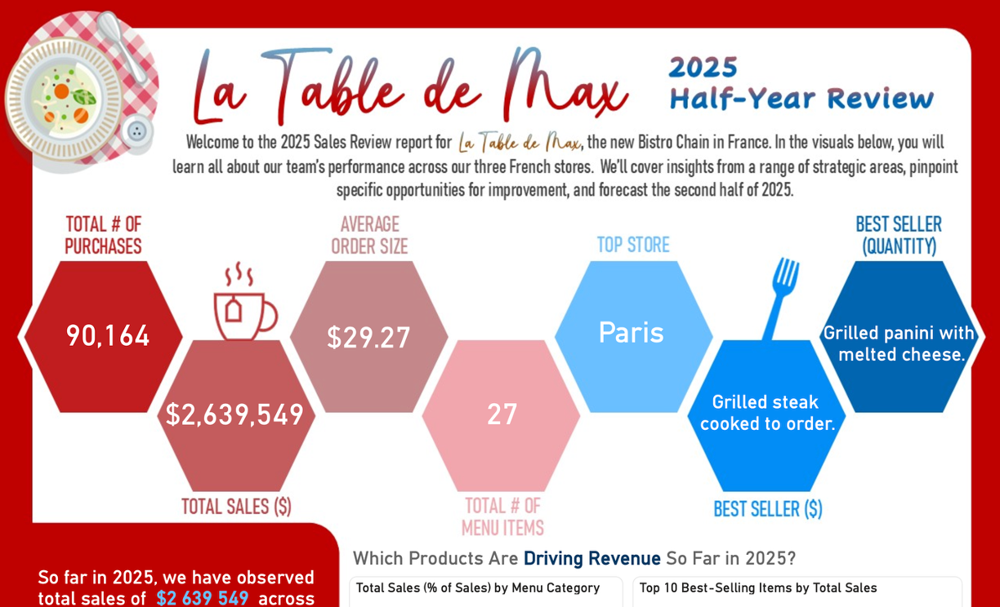
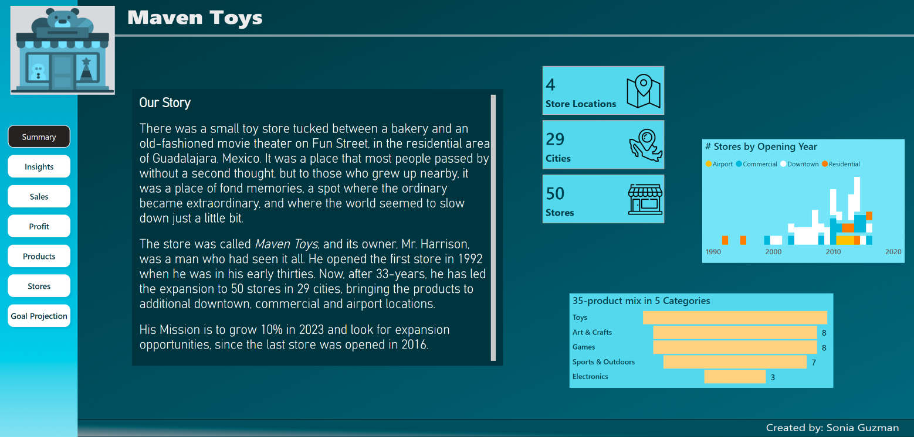

# Sonia Guzman Habegger - Data Analysis Portfolio

<!--Welcome! This repository contains the complete template for a professional, one-page data analysis portfolio website, hosted for free on GitHub Pages. -->

## About This Portfolio Template

This portfolio is designed to demonstrate skills in:
- Data visualization and storytelling
- Data modeling and analysis
- Creating interactive, professional dashboards
- Transforming complex data into actionable insights

## 🚀 Projects

<!This template is set up to showcase your best work. You can easily customize the project cards in the `index.html` file. -->

### La Table de Max
*Sales analysis infographic of a fictional restaurant chain in Paris (data created with ChatGPT).*

# 📷 Project Preview

<a class="github-button"
   href="[https://github.com/your-username/your-repo-name](https://github.com/soniaguzmanhabegger/La-Table-de-Max)"
   data-icon="octicon-star"
   data-size="large"
   aria-label="Star your-repo-name on GitHub">

👉 [View the project Repository](https://github.com/soniaguzmanhabegger/La-Table-de-Max-app)

👉 [View PDF](./La_Table_de_Max.pdf)

<a href="(https://github.com/soniaguzmanhabegger/La-Table-de-Max)" target="_blank" title="GitHub"><i class="fab fa-github"></i></a>

### Maven Toys
*Sales analysis of a fictional toy store (Maven Analytics public data).*

# 📷 Project Preview

<a class="github-button"
   href="[https://github.com/your-username/your-repo-name](https://github.com/soniaguzmanhabegger/La-Table-de-Max)"
   data-icon="octicon-star"
   data-size="large"
   aria-label="Star your-repo-name on GitHub">

👉 [View PDF](./Maven_Toys.pdf)

## 🛠️ Skills

Update the `index.html` file to reflect your personal technical skillset. The template is organized into key categories:

- **Data Visualization**: Power BI.
- **Data Modeling**: Power Query, DAX, Star Schema Design.
- **Reporting**: Visualizations adapted to Project, Data Insights, Storytelling, User Experience.
<!--- **Data Analysis**: SQL, Python (Pandas), R, Excel, etc.-->

### 3. Customize Your Portfolio
Open the `index.html` file and begin personalizing it. The file contains helpful `<!--💡UPDATE: ... -->` comments to guide you on where to change:
- Your name and title
- Social media links
- The "About Me" section
- Your project titles, descriptions, and links
- Your list of skills

### 4. Add Your Files
- Upload your profile photo and project preview images to the `assets/images/` folder.
- Upload your CV (e.g., in PDF format) to the `assets/` folder.
- Create your favicon and add it to the root folder.

Once you commit your changes, your new portfolio website will be live at `https://your-username.github.io` within a few minutes!
